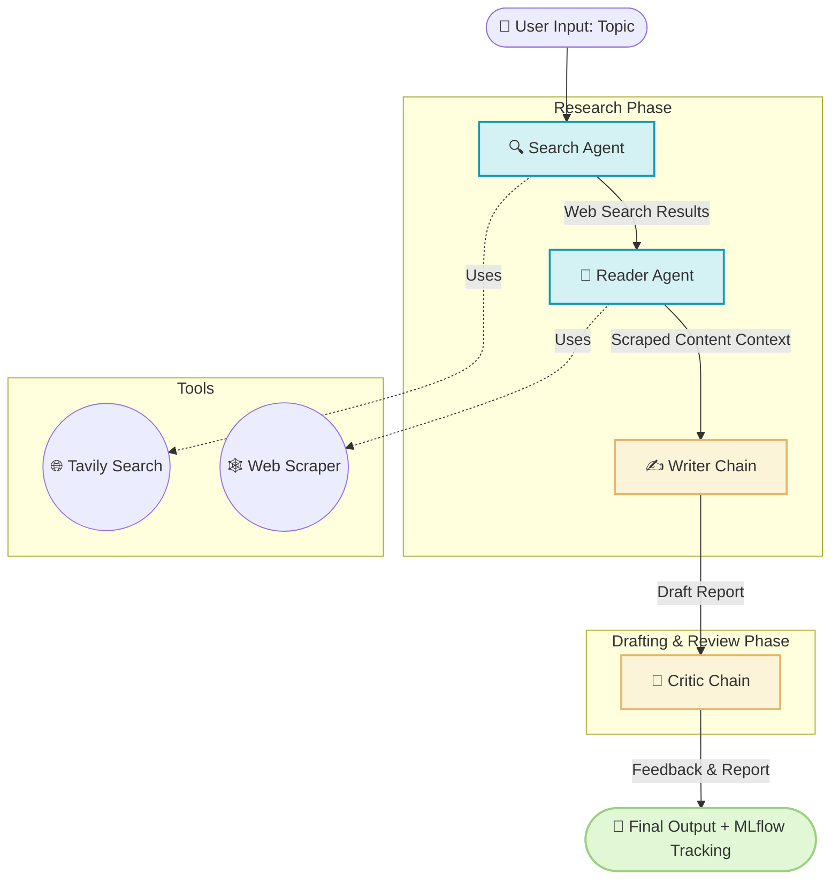

# 🤖 LangChain Multi-Agent Research System

A simple, yet powerful multi-agent AI application designed to autonomously research any topic on the web, write a detailed structured report, and critically review its own work.

---

## 🏗️ System Architecture



---

## 🧠 How it Works (Deep Dive)

The system is built on **LangChain** and splits the workload among 4 specialized AI components:

### 1. 🔍 Search Agent

**What it does:** It takes your topic and browses the internet to find the most relevant and recent information.
**How it works:** It uses the **Tavily API** tool to perform high-quality search queries, aggregating links, snippets, and answers.

### 2. 📖 Reader Agent

**What it does:** It acts as a deep researcher. It doesn't just read the search snippets; it actually visits the links.
**How it works:** It selects the most promising URLs from the Search Agent and uses a **Web Scraping Tool** (powered by BeautifulSoup/Trafilatura) to extract the full readable text of those pages.

### 3. ✍️ Writer Chain

**What it does:** It takes all the raw data (search snippets + deeply scraped text) and synthesizes it into a well-structured, professional report.
**How it works:** It uses a custom prompt template defined in `config/prompts.yaml` to format the findings logically (Introduction, Main Findings, Conclusion).

### 4. 🧐 Critic Chain

**What it does:** It acts as an editor-in-chief.
**How it works:** It reviews the drafted report against strict quality standards (accuracy, flow, depth) and outputs constructive feedback on how it could be improved.

---

## 🚀 Setup & Installation

### 1. Requirements

- Python **3.12+**
- API Keys for **Tavily**, **OpenRouter**, and **DagsHub**

### 2. Install Dependencies

We use `uv` for lightning-fast package management (or you can use standard `pip`). The project now includes a `Makefile` for convenience.

```bash
# Clone the repository
git clone <repository-url>
cd LangChain-Multi-Agent-Research-System

# Create virtual environment and install requirements
make create_venv
make install
```

### 3. Environment Variables

Create a `.env` file in the root directory:

```env
TAVILY_API_KEY=your_tavily_api_key
OPENROUTER_API_KEY=your_openrouter_api_key
```

---

## 🎯 How to Run the Project

### Option A: Run the UI (Recommended)

We have a beautiful Web UI built with Streamlit!

```bash
make run_ui
# Or manually: uv run streamlit run app.py
```

This will open a browser window where you can type your topic and see the agents' outputs in real-time.

### Option B: Run in Terminal

You can run the research pipeline directly using the provided `Makefile` (which runs `test_mlflow.py`) or by executing the pipeline module.

**To run the main pipeline directly:**

```bash
uv run python -m src.pipeline.pipeline
```

### Option C: Run as a REST API (FastAPI)

If you want to integrate this research system into another application, you can serve it as an API!

```bash
make run_api
# Or manually: uv run uvicorn api:app --reload
```

This will start a local server at `http://localhost:8000`.

- **Swagger Documentation:** Visit `http://localhost:8000/docs` to see the interactive API docs.
- **Usage Example:**
  ```bash
  curl -X POST "http://localhost:8000/research" \
       -H "Content-Type: application/json" \
       -d '{"topic": "Artificial Intelligence in Healthcare"}'
  ```

*(Inside `pipeline.py`, change the test topic at the bottom if you want to research something specific).*

---

## 📊 Experiment Tracking (DagsHub & MLflow)

This project is fully integrated with **DagsHub** and **MLflow** to track your LLM experiments.

Every time you run the `run_research_pipeline()` function, the system automatically:

- **Logs Parameters:** Records the `topic` researched.
- **Logs Metrics:** Tracks the length of the generated report and the amount of scraped context.
- **Logs Artifacts:** Uploads the final generated `report.txt` and `critic_feedback.txt` directly to your DagsHub repository!

**How to authenticate:**
The first time you run it, your terminal will prompt you for your DagsHub token. Once provided, all your runs will be beautifully visualized in your DagsHub dashboard.

---

## 📂 Project Structure

```text
.
├── config/
│   └── prompts.yaml          # 📝 System prompts for Writer and Critic
├── src/
│   ├── agents/agents.py      # 🤖 LangChain Agents & LLM setup
│   ├── pipeline/pipeline.py  # ⚙️ The main engine connecting all components
│   ├── tools/search_tool.py  # 🌐 Tavily search implementation
│   ├── tools/scrape.py       # 🕸️ Web scraping logic
│   ├── logger/               # 📜 Logging system
│   └── exception/            # ⚠️ Error handling
├── Makefile                  # 🛠️ Easy terminal commands (install, run, clean)
├── pyproject.toml            # 📦 Dependencies list (including mlflow & dagshub)
└── .env.example              # 🔐 Template for API keys
```
